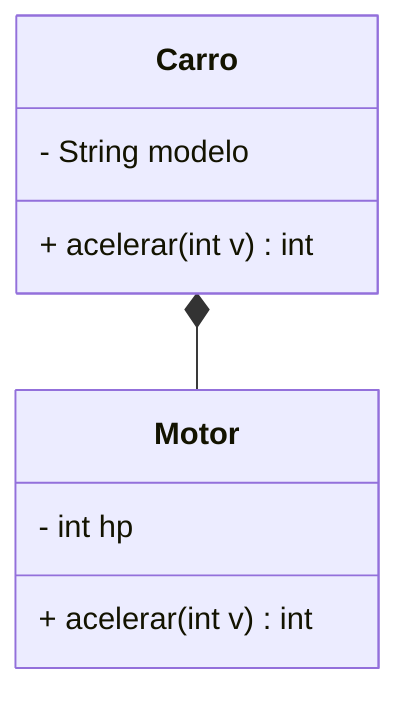

# Diagrama de classes UML

```mermaid

classDiagram
    class Carro{
        - String modelo
        + acelerar(int v) int
    }
    
    class Motor{
        - int hp
        + acelerar(int v) int
    }
    
    Carro *-- Motor

```
- ###  link marmaid
- https://mermaid.js.org/syntax/classDiagram.html 
